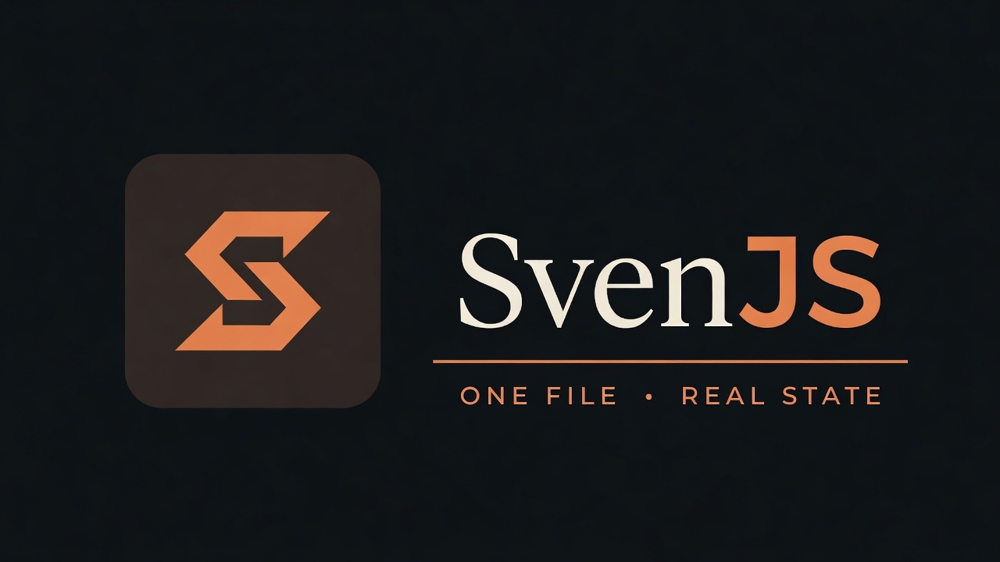

<p align="center">
  
</p>

# SvenJS

**A tiny JavaScript UI runtime for composable web apps.** Start with one HTML file, then grow into JSX, SSR, and hydration without changing your mental model.

[Website](https://svenjs.vercel.app/) · [Playground](https://svenjs.vercel.app/play/) · [Documentation](https://svenjs.vercel.app/docs/) · [Mission Control demo](https://svenjs.vercel.app/demo/mission-control/)

## Ship something before you set up a build

Save this as `hello.html`, open it in a browser, and you have a stateful UI. No Node, npm, or bundler required.

```html
<script src="https://unpkg.com/svenjs@3"></script>
<div id="app"></div>
<script>
  const { create, render, html } = Svenjs;

  const App = create({
    initialState: { clicks: 0 },
    render() {
      return html`
        <button onClick=${() => this.setState({ clicks: this.state.clicks + 1 })}>
          Clicked ${this.state.clicks} times
        </button>
      `;
    },
  });

  render(App, document.getElementById("app"));
</script>
```

## Give it to an LLM

Paste the prompt below into ChatGPT, Codex, or another coding assistant, then replace the bracketed product brief. It asks for a single file that you can save and open immediately.

```text
Build [DESCRIBE THE PAGE OR APP] as a complete, self-contained `hello.html` using SvenJS 3.

Use this exact browser setup:

<script src="https://unpkg.com/svenjs@3"></script>
<div id="app"></div>
<script>
  const { create, render, html } = Svenjs;
  // application code
  render(App, document.getElementById("app"));
</script>

Rules:
- Use SvenJS only. Do not use React, Vue, a bundler, npm, imports, or a build step.
- Define UI units with `create({ initialState, render() { ... } })`.
- Write markup with `html` tagged templates, not JSX.
- Read component state from `this.state`. `this.setState(nextState)` replaces the whole state object, so retain every field that should remain.
- Use `onClick=${() => ...}` and other DOM event props for interactions.
- Give dynamic list items stable `key` values.
- Keep CSS in a `<style>` tag in the same file. Use semantic HTML and accessible labels.
- Return only the finished HTML file in one code block. Do not include setup steps or an explanation.

Make the result polished, responsive, and fully functional when opened directly from disk.
```

## Why SvenJS

- **Start small.** A script tag and a single HTML file are enough for an interactive page. The playground can export the result as a self-contained `.html` file.
- **Keep the model simple.** Components own state; `setState` replaces it; composition is plain JavaScript. In development, state is cloned and deep-frozen to surface accidental mutation.
- **Make updates count.** Keyed DOM patching preserves identity in dynamic lists, while unchanged child components and unchanged DOM properties are skipped.
- **Use the platform.** JSX or tagged templates, DOM events, SVG, `data-*` and `aria-*` attributes, refs, and ordinary browser APIs all work directly.
- **Grow without a rewrite.** Use the same component tree in a Vite app, render it to HTML on the server, and hydrate it in the browser.

## Choose your path

| When you need | SvenJS gives you |
| --- | --- |
| A small interactive page | A script-tag build, tagged templates, and no build step |
| A typed app | ESM, TypeScript declarations, JSX, and `jsxImportSource` support |
| Fast initial HTML | `renderToString()` and `hydrate()` for the same component tree |
| Shared state | Stores plus `this.observe(store)` with automatic cleanup on unmount |
| A realistic example | Mission Control: 100 live units, keyed sorting, SVG telemetry, and one-file export |

## Use JSX when your app needs it

Install SvenJS in any modern build setup:

```bash
npm install svenjs
```

```jsx
import { create, render } from "svenjs";

const Counter = create({
  initialState: { count: 0 },
  render() {
    const { count } = this.state;
    return <button onClick={() => this.setState({ count: count + 1 })}>{count}</button>;
  },
});

render(Counter, document.getElementById("app"));
```

Tell TypeScript to use SvenJS's JSX runtime:

```json
{
  "compilerOptions": {
    "jsx": "react-jsx",
    "jsxImportSource": "svenjs"
  }
}
```

## Render once, then hydrate

The server and the browser use the same component tree:

```jsx
import { hydrate, renderToString } from "svenjs";

// server
const markup = renderToString(<App url="/docs" />);

// browser
hydrate(<App url={location.pathname} />, document.getElementById("app"));
```

## See it under load

[Mission Control](https://svenjs.vercel.app/demo/mission-control/) exercises the runtime with 100 synthetic telemetry streams, shared state, keyed sorting, SVG charts, lifecycle cleanup, persisted preferences, and an offline one-file export. It is both a live demo and a useful reference for building a data-heavy interface without a large framework.

## Develop SvenJS

```bash
pnpm install
pnpm dev
```

| Command | What it does |
| --- | --- |
| `pnpm dev` | Runs the docs and playground at http://localhost:5173 |
| `pnpm test` | Runs the runtime test suite with Vitest |
| `pnpm test:e2e` | Runs Playwright smoke tests for the site |
| `pnpm build` | Builds the library and site |
| `pnpm --filter svenjs size` | Reports raw and gzip sizes for the ESM and script-tag builds |

The repository contains the `svenjs` runtime in `packages/svenjs` and the documentation, demos, and playground in `apps/www`.

## Migration from 2.x

SvenJS 3 is a rewrite, not a drop-in upgrade. `svenjsx-loader` is gone, and `setState` still replaces rather than merges state. See [Heritage](apps/www/src/pages/heritage.tsx) for the 2.x → 3.x story.

## License

[ISC](LICENSE)
